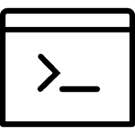

   
<h3> EUNJI KIM </h3>
<b>Machine Learning Developer</b>   
 <a href="https://github.com/KEJdev">  https://github.com/KEJdev </a>    
<a href="mailto:kej12516@gmail.com">   kej12516@gmail.com  </a>    

 

   PROJECTS & COMPETITION

- 2018 네이버 해커톤 결승 진출 (40등 中 14등)
- 2019 인공지능 R&D 그랜드 챌린지 대회 참여
- Emotional Analysis (얼굴 감정 분석)
- 흉부 X-ray 질병 분류
- 신용대출에 따른 대출금상환 분석

 

   SKILLS & PROFICIENCY

**PYTHON**

  
80%

**R**

  
80%

**JAVA**

  
60%

**SQL & PLSQL**

  
60%

**Linux**

  
50%

